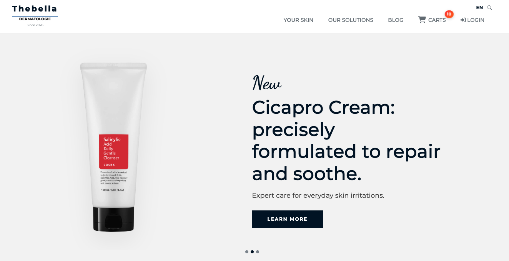

<h1 align="center" id='header'>The Bella</h1>
<div align="center">
<!-- Gmail Account -->
<a href="mailto:jayed.swe@gmail.com">

</a>
<a href="tel:+8801987132107">

<a href="https://jayedswe.netlify.app/" target="_blank">

</a>
<a href="https://www.facebook.com/jibon969" target="_blank">


<a href="https://www.linkedin.com/in/jibon969/" target="_blank">

</a>
<a href="https://github.com/jibon969" target="_blank">

</a>
</div>

<hr/>

#### 01. How to run this project

```
How to install packages and run this django project.
```

<details>
<summary style="cursor:pointer">Solution</summary>

```py
# Step 1 : Create virtualenv

# For Mac
python3 -m venv venv
source venv/bin/activate

# For windows
venv\Scripts\activate

# Step 2 : Clone project
git clone git@github.com:belasea/the_bella.git
cd the_bella

# Step 3 : Install Packages
pip install -r requirements.txt

# Step 4 : Run this project
python manage.py runserver

# Step 5 : makemigrations
python manage.py makemigrations about accounts addresses analytics blog carts comments contacts home inventory notification offers orders products report warehouse


python manage.py migrate

python manage.py createsuperuser

admin@gmail.com
admin12345
```
</details>


#### 02. Django PostgreSQL

```
Django PostgreSQL
```

<details>
<summary style="cursor:pointer">Solution</summary>

```py
# create database local_db
postgres=# create database local_db;
CREATE DATABASE
postgres=# \l

# Connect DB
postgres=# \c local_db;
You are now connected to database "local_db" as user "postgres".
# Show relations
local_db=# \d

# Django Settings.py
DATABASES = {
   'default': {
       'ENGINE': 'django.db.backends.postgresql',
       'NAME': 'local_db',
       'USER': 'postgres',
       'PASSWORD': 'root',
       'HOST': '127.0.0.1',
       'PORT': '5432',
   }
}
```
</details>

#### 03. Python shell script

```
Python shell script
```

<details>
<summary style="cursor:pointer">Solution</summary>

```py
# Create the setup.sh file using echo

echo @echo off > setup.sh

# Step 2: Open file using nano setup.sh

nano setup.sh

past here 

echo "Restarting Nginx...."
sudo systemctl restart nginx
echo "Restarting Gunicorn..."
sudo systemctl restart gunicorn

ctrl + x and Y then Enter

# Step 3: Make the script executable:

chmod +x setup.sh

# Step 4: Execute the script:

./setup.sh

```
</details>


#### 04. How to configure nginx and Gunicorn Configuration
```
How to configure nginx and Gunicorn Configuration
```
<details>
<summary style="cursor:pointer">Solution</summary>

```py
ssh djangoadmin@


from pathlib import Path
BASE_DIR = Path(__file__).resolve().parent.parent
SECRET_KEY = '2abbb66e6262d8a471b69c7jayedhossainjibona03a0c74bjibon969'


ALLOWED_HOSTS = ['*', '']
BASE_URL = ""

DATABASES = {
   'default': {
       'ENGINE': 'django.db.backends.postgresql',
       'NAME': '_db',    # Database Name
       'USER': 'dbadmin',            # User Name
       'PASSWORD': '75#@!DB',  # Password for Postgresql
       'HOST': '127.0.0.1',          # Django Server
       'PORT': '5432',               # default port for Postgresql
   }
}

# Gmail Setting =======================================================
try:
    # Sending E-mail Configuration ==============================
    EMAIL_BACKEND = 'django.core.mail.backends.smtp.EmailBackend'
    EMAIL_HOST = 'smtp.gmail.com'
    EMAIL_PORT = 587
    EMAIL_USE_TLS = True
    EMAIL_HOST_USER = '@gmail.com'
    EMAIL_HOST_PASSWORD = 'bopeqjiwmwntxekl'
except:
    pass


STATIC_URL = "/static/"
STATICFILES_DIRS = [
    BASE_DIR / "static"
]
STATIC_ROOT = BASE_DIR / "staticfiles"

# Media files (uploads)
MEDIA_URL = "/media/"
MEDIA_ROOT = BASE_DIR / "media"


```
</details>

#### 05. Fixed Bottom Footer Section
```
Fixed Bottom Footer Section
```
<details>
<summary style="cursor:pointer">Solution</summary>

```py
<!DOCTYPE html>
<html lang="en">
  <head>
    <meta charset="UTF-8" />
    <meta name="viewport" content="width=device-width, initial-scale=1.0" />
    <title> Smart Mailer </title>
    <link rel="shortcut icon" href="" type="image/x-icon" />
    <link rel="shortcut icon" href="" type="image/x-icon"/>
    <!-- Google Fonts -->
    <link href="https://fonts.gstatic.com" rel="preconnect" />
    <!-- Custom CSS -->
    <link rel="stylesheet" href="" />
  </head>
  <body class="d-flex flex-column min-vh-100">

    <!-- ======= Footer ======= -->
    <footer id="footer" class="footer fixed-bottom" >
        <div class="copyright">
        &copy; Copyright <span class="brand-name">Smart Mailer</span>.
        All Rights Reserved
        </div>

        <div class="credits">
        Designed by <a href="https://jayedswe.netlify.app/" target="blank">
            <span class="credit-name">Jibon Ahmed</span>
        </a>
        </div>
    </footer>
    <!-- End Footer -->

    <a href="#" class="back-to-top d-flex align-items-center justify-content-center">
        <i class="bi bi-arrow-up-short"></i>
    </a>

    <!--========================= Js Library =============================================-->
    <script
      src="https://cdn.jsdelivr.net/npm/bootstrap@5.3.3/dist/js/bootstrap.bundle.min.js"
      integrity="sha384-YvpcrYf0tY3lHB60NNkmXc5s9fDVZLESaAA55NDzOxhy9GkcIdslK1eN7N6jIeHz"
      crossorigin="anonymous"></script>
  </body>
</html>

body {
  background-color: #ffffff;
  color: #000000;
  height: 100%;
  display: flex;
  flex-direction: column;
}

#main {
  margin-top: 60px;
  padding: 1px;
  transition: all 0.3s;
  flex: 1 0 auto;
  margin-bottom: 70px;
}

.footer {
  border-top: 1px solid #cddfff;
  flex-shrink: 0;
  background: #f8f9fa;
  text-align: center;
  padding: 15px 0;
}
```
</details>

<h3>Project ScreenShort </h3>
<hr/>


#### Example
```
Example
```
<details>
<summary style="cursor:pointer">Solution</summary>

```py

```
</details>